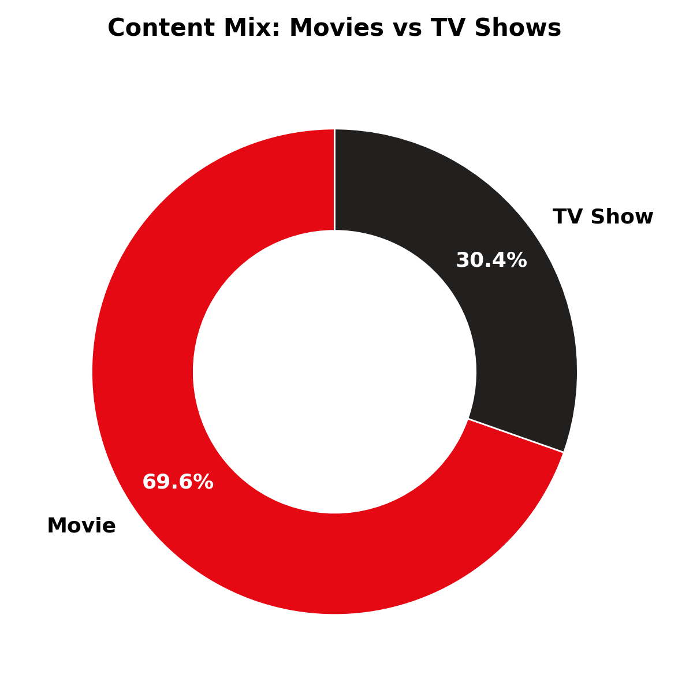
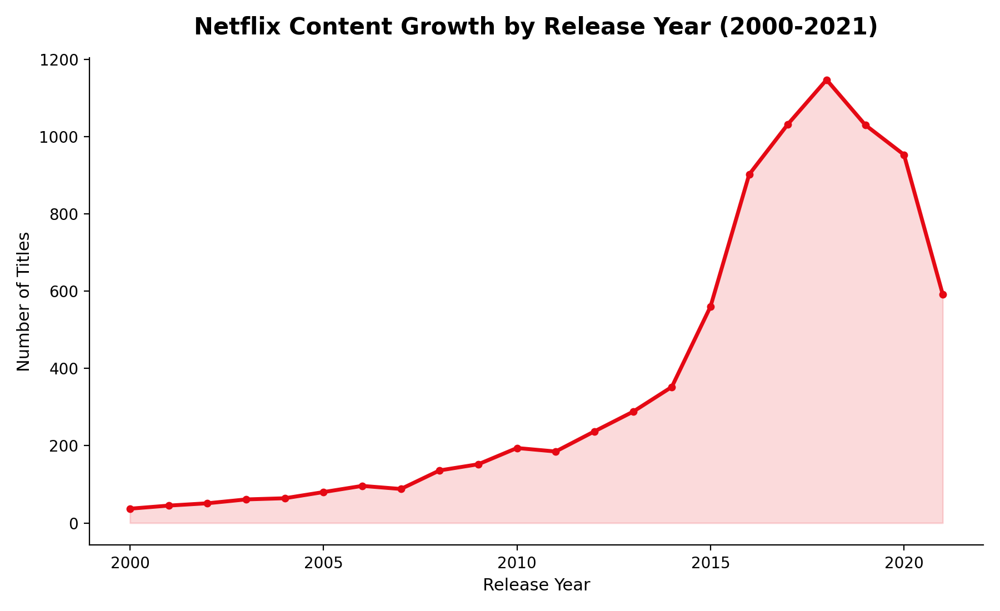
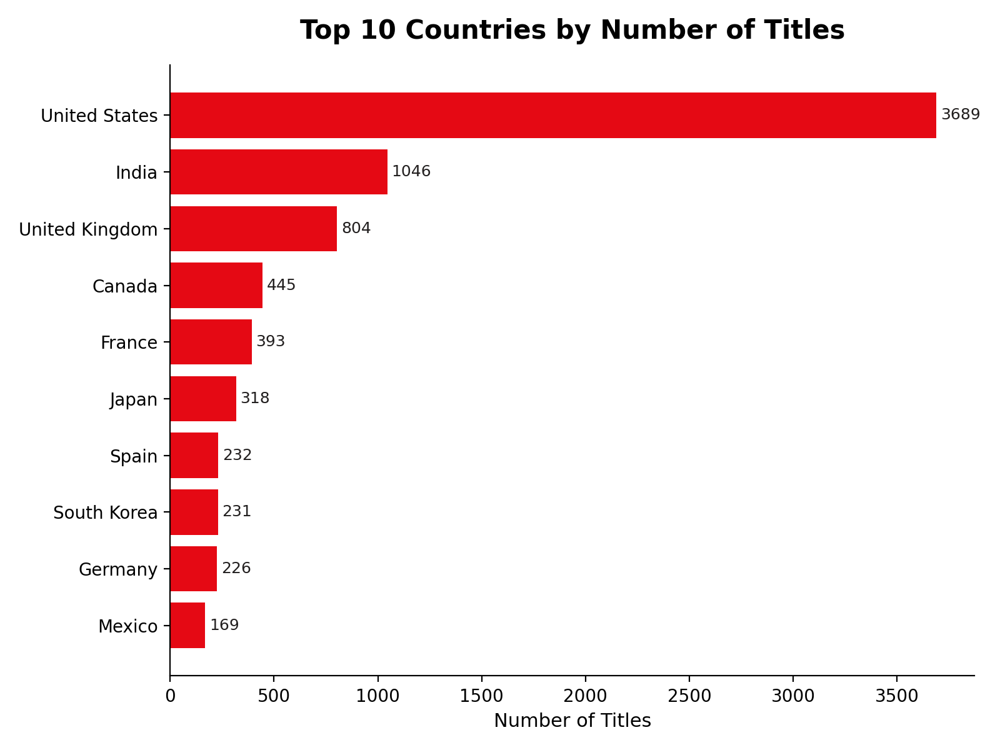
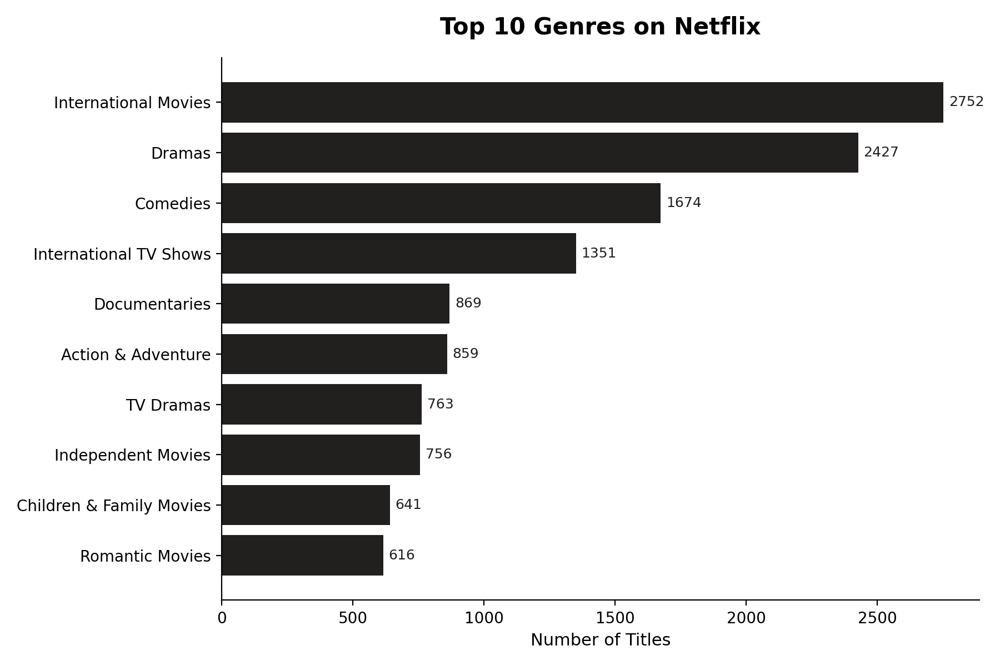
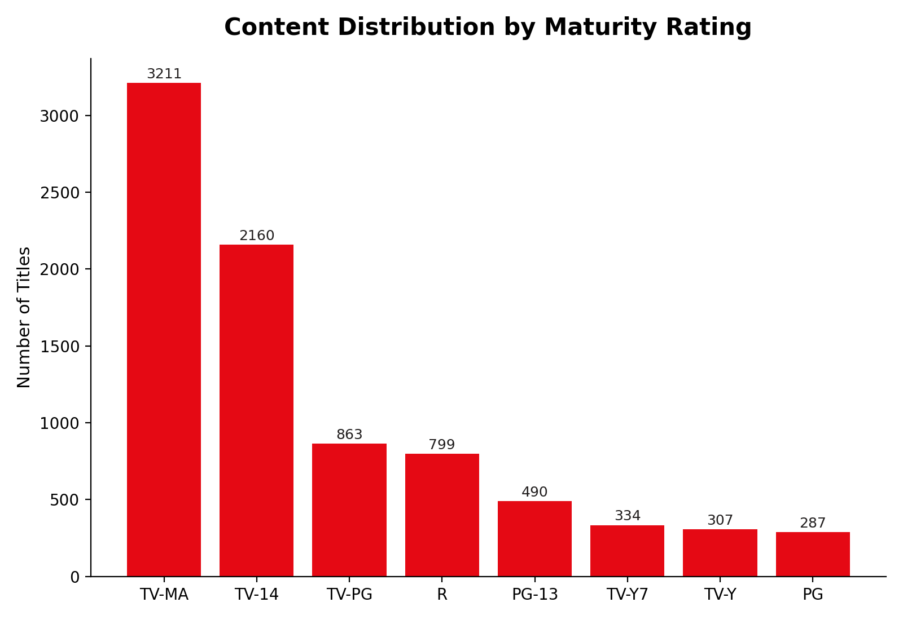
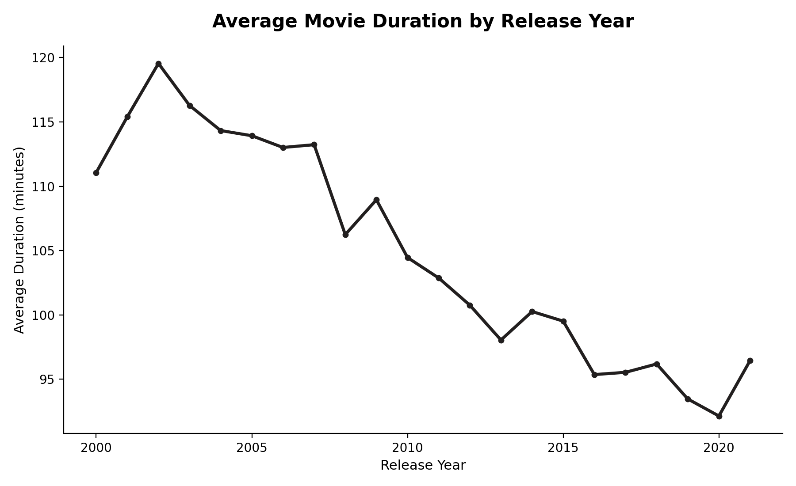

# 🎬 Netflix Content Analysis

Exploratory data analysis and an interactive Power BI dashboard uncovering content trends, catalog composition, and audience-targeting patterns across Netflix's global title library.


---

## 📌 Overview

Netflix's catalog spans thousands of titles across dozens of countries, genres, and content ratings. This project analyzes the full public Netflix titles dataset to answer questions a content strategy or growth team would actually ask:

- Is the platform's catalog shifting from movies toward TV shows?
- Which countries and genres dominate the content library, and where is the growth headroom?
- How has content acquisition volume changed over time, and what does that suggest about strategy?
- Are runtimes trending shorter to match changing viewing habits?

The end-to-end workflow — data cleaning, exploratory analysis in Python, and an interactive Power BI dashboard — mirrors the kind of ad-hoc analytics request a Data Analyst would receive from a Content or Product Insights team.

## 🧠 Business Problem

Streaming platforms compete on catalog depth and relevance. Decisions about content licensing budgets, regional investment, and production priorities depend on understanding **what already exists in the catalog and how it has evolved**. This analysis turns a raw metadata export into a decision-ready view of catalog composition and growth.

## 🗂️ Dataset

| | |
|---|---|
| **Source** | [Netflix Movies and TV Shows dataset](https://www.kaggle.com/datasets/shivamb/netflix-shows) (Kaggle) |
| **File** | `netflix_titles.csv` |
| **Records** | 8,807 titles |
| **Fields** | `show_id`, `type`, `title`, `director`, `cast`, `country`, `date_added`, `release_year`, `rating`, `duration`, `listed_in` (genre), `description` |
| **Time span** | Titles released 1925–2021 |

## 🛠️ Tools & Tech Stack

- **Python** — Pandas, NumPy for data cleaning and aggregation
- **Matplotlib / Seaborn** — exploratory visualization
- **Power BI** — interactive, filterable dashboard for stakeholder consumption
- **Jupyter Notebook** — analysis environment

## 🔍 Methodology

1. **Data Cleaning**
   - Audited all 12 columns for missing values (`director`, `cast`, `country`, `date_added`, `rating`, `duration` all contained nulls)
   - Imputed categorical gaps (`director`, `cast`, `country` → `"Unknown"`; `rating` → mode) rather than dropping rows, to preserve sample size for aggregate analysis
   - Checked for and confirmed zero duplicate records
   - Applied an IQR-based outlier scan to numeric fields
2. **Feature Engineering**
   - Parsed the `duration` field into a numeric `duration_min` column for movies
   - Split multi-value fields (`country`, `listed_in`) on delimiters and exploded them so each title-country and title-genre pair is counted individually, avoiding the distortion of treating `"Dramas, International Movies"` as one category
3. **Exploratory Data Analysis**
   - Content mix (Movies vs. TV Shows), geographic distribution, genre popularity, maturity-rating breakdown, year-over-year acquisition volume, and runtime trends
4. **Dashboard**
   - Rebuilt the key EDA views as an interactive two-page Power BI report (`netflixDashboard.pbix`) with slicers for `type` and `country`, letting a non-technical stakeholder self-serve the same insights

## 📊 Key Insights

- **Movies dominate the catalog:** 69.6% of titles are movies vs. 30.4% TV shows (6,131 vs. 2,676), indicating Netflix's library remains film-heavy even as prestige TV drives subscriber growth industry-wide.
- **The U.S. and India lead content supply:** The United States contributes 3,689 titles and India 1,046 — nearly 3x the next-closest country (United Kingdom, 804) — confirming India as Netflix's most important growth market outside the U.S.
- **International and drama content are catalog anchors:** *International Movies* (2,752 titles) and *Dramas* (2,427 titles) are the two largest genre tags, well ahead of *Comedies* (1,674), reflecting a deliberate localization strategy.
- **Mature content is the norm:** TV-MA is the single largest rating category (3,211 titles, ~36%), followed by TV-14 (2,160) — the catalog skews toward adult and young-adult audiences rather than family content.
- **Acquisition accelerated sharply from 2015–2019:** Titles released per year grew from 237 (2012) to a peak of 1,147 (2018), a ~5x increase, before declining in 2020–2021 — consistent with a content land-grab phase followed by a shift toward originals and pandemic-era production slowdowns.
- **Average movie runtime is trending shorter:** Mean movie duration fell from ~115 minutes for pre-2005 releases to 96.4 minutes in 2021, aligning with industry-wide shifts toward shorter, more mobile-friendly viewing formats.
- **India skews overwhelmingly toward film:** Of 1,046 Indian titles, 962 (92%) are movies versus only 84 TV shows — a sharp contrast to the platform's overall 70/30 split, highlighting an opportunity for regional TV/series investment.

## 📈 Visualizations

<table>
<tr>
<td></td>
<td></td>
</tr>
<tr>
<td></td>
<td></td>
</tr>
<tr>
<td></td>
<td></td>
</tr>
</table>

## 📋 Interactive Dashboard

`netflixDashboard.pbix` is a two-page Power BI report featuring:
- KPI cards (total titles, catalog average duration, title counts by segment)
- A Movies vs. TV Shows breakdown, top-countries bar chart, genre and rating column charts, and a release-year trend line
- Interactive **type** and **country** slicers so stakeholders can filter the entire report without touching the underlying data

> Open `netflixDashboard.pbix` in Power BI Desktop to explore the report interactively.

## 📁 Repository Structure

```
Netflix-Content-Analysis/
├── README.md
├── Netflix_Analysis.ipynb        # Full data cleaning + EDA notebook
├── netflix_titles.csv            # Source dataset
├── netflixDashboard.pbix         # Power BI interactive dashboard
├── Netflix_Analysis_Presentation.pptx
└── assets/                       # Chart images used in this README
```

## ▶️ How to Run

```bash
git clone https://github.com/Deepti-Ravishankafr/Netflix-Content-Analysis.git
cd Netflix-Content-Analysis
pip install pandas numpy matplotlib seaborn jupyter
jupyter notebook Netflix_Analysis.ipynb
```

To explore the dashboard, open `netflixDashboard.pbix` in [Power BI Desktop](https://powerbi.microsoft.com/desktop/) (free).

## 🔮 Future Work

- Enrich with viewership/engagement data (where available) to move from *catalog composition* to *content performance*
- Add sentiment analysis on `description` text to profile tone and theme by genre
- Build a recommendation-style content-gap model comparing genre supply against regional demand signals

## 👤 Author

Deepti R
📧 deeptiravishankar92@gmail.com 

---
*This project uses a publicly available dataset for educational and portfolio purposes. No proprietary Netflix data was used.*
